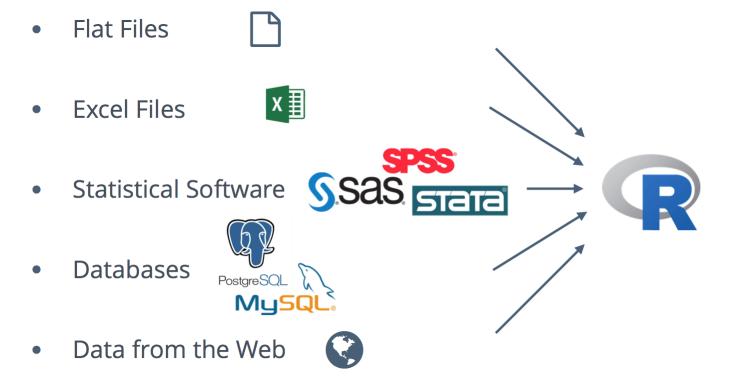
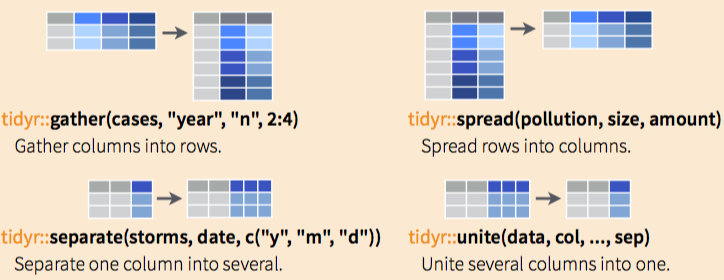

```{r setup, echo = FALSE}
knitr::opts_chunk$set(
  message = FALSE,
  fig.width = 10,
  fig.height = 4,
  comment = "#>",
  collapse = TRUE,
  warning = FALSE
)
```


        
# Overview


## Goals 

### **You will learn:**

<center></center>
<center> Data science cycle (source: [R for Data Science](http://r4ds.had.co.nz/))</center>
 
### **You won't learn**

\


+ Big data  

+ Non-rectangular data

+ Hypothesis confirmation

## Why R

* R is Free

* R is Popular

* R is Powerful 

* R is Flexible

* R is Well Supported

* R is a production language 

## Data import 

<center></center>


## Data tidying and transformation 

<center></center>


## Data visualisation and modeling

<center></center>

## Results communication 

<center></center>


<div align="center">
  
</div>


## Outline

### __Day 1: Data visualisation and transformation__ 


* Introduction to RStudio


* [R demo](Rdemo.Rmd)    


* R data structures

* Data visualisation with __ggplot2__ 

* Data transformation with __dplyr__ 


## Outline

### __Day 2: Data import and wrangling__

\


* Data transformation with __dplyr__ (continued)

* Data wrangling

* Tibbles with **tibble**

* Data import

* Tidy data with tidyr 

## Outline

### __Day 3: Examples of practical machine learning using R__ 

\


* Linear regression in R 

* Logistic regression in R 

* Decision trees in R 


