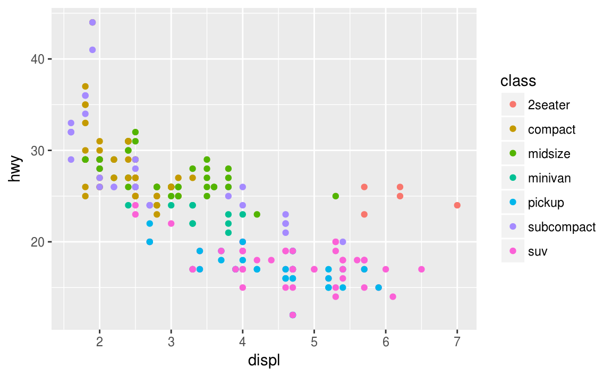
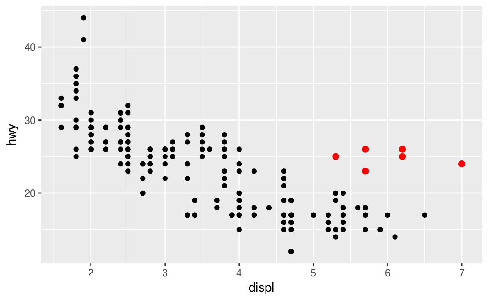

```{r setup, echo = FALSE}
knitr::opts_chunk$set(
  message = FALSE,
  fig.width = 10,
  fig.height = 4,
  comment = "#>",
  collapse = TRUE,
  warning = FALSE
)
```


        


# Data Exploration


## Getting to know your data
Once we have data loaded, it is always wise to familiarize ourselves with variables in the dataset, both individually and their relationships.

First we will read in some data and store it in the object we name d. We prefer short names for objects that we will use frequently.

The dataset contains several school, test, and demographic variables for 200 students.

In this section, we will explore data with both numeric summaries and graphical depictions.

##

```{r}
library(tidyverse)
d <- read_csv("https://stats.idre.ucla.edu/stat/data/hsbraw.csv")
```

##

```{r}
d
```

## Continuous and categorical variables
We can distinguish generally between variables measured continuously (quantitative) and those measured categorically (membership to a class).

Methods to explore the two types of variables differ somewhat, so we will visit each separately initially.

We first explore the continuous variables in the dataset, which are the academic test score variables, "read", "write", "math", "science", and "socst".

## Exploring continuous variables numerically
Common numeric summaries for continuous variables are the mean, median, and variance, obtained with` mean()`, `median()`, and `var()` (`sd()` for standard deviation), respectively.

summary() on a numeric vector provides the min, max, mean, median, and first and third quartiles (interquartile range).
```{r}
mean(d$read)
median(d$read)
var(d$read)
summary(d$read)
```

## Introducing ggplot2 for graphics


We will be using the package `ggplot2`, part of the tidyverse, to create plots for exploring our data. Although base `R` has powerful and flexible graphic capabilities on its own, we prefer the approach that `ggplot2` takes.

* `ggplot2` uses a structured grammar of graphics that provides an intuitive framework for building graphics layer-by-layer, rather than memorizing lots of plotting commands and options

* `ggplot2` graphics take less work to make beautiful and eye-catching

## Basic syntax of a ggplot2 plot
The basic specification for a `ggplot2 `plot is to specify which variables are mapped to which aspects of the graph (called aesthetics) and then to choose a shape (called a geom) to display on the graph.

For example, we can choose to map one variable to the x-axis, another variable to the y-axis, and to use `geom_point()` as the shape to plot, which produces a scatter plot.
Within the `ggplot()` function we specify (Note that the package is named ggplot2 while this function is called `ggplot()`):

* the dataset
* inside an `aes()` function, we then specify which variables are
mapped to which aesthetics, which can include:

    * `x`-axis and `y`-axis
    * color, size, and shape of objects
    
For a much more detailed explanation of the grammar of graphics underlying ggplot2, see [r4ds](http://r4ds.had.co.nz/data-visualisation.html)

## 

```{r}
# a scatterplot of read vs write
ggplot(data=d, aes(x=write, y=read)) + geom_point()
```

## Exploring continuous Variables: Histograms
We can inspect the distributions of continuous variables with histograms, density plots, and boxplots. Each of these plots has a corresponding `ggplot2` geom.

Histograms bin continuous variables into intervals and count the frequency of observations in each interval.

For histograms and density plots, we will map the variable of interest to `x`.

##

```{r}
# use the bins= argument to control the number of intervals
ggplot(d, aes(x=write)) + geom_histogram(bins=10)
```


## 
We can also look at distributions for a subset of our data. Here we examine the distribution for `write` for students `with` math score below the mean math score:
```{r}
# Requesting the rows where math is less than its mean
ggplot(d[d$math < mean(d$math),], 
       aes(x=write)) + geom_histogram(bins=10)
```


## Exploring continuous vars: Density plots
Density Plots smooth out the shape of histograms:

```{r}
ggplot(d, aes(x = write)) + geom_density()
```

## Exploring continuous vars: boxplots
Boxplots show the median, lower and upper quartiles (the hinges), and outliers.Unlike histograms and density plots, map the variable whose distribution we want to plot to y instead of x. If we are making a single boxplot, we need an arbitrary value for x, just as a place holder.

```{r}
# for the overall distribution of one variable, specify x=1 (or any other value)
ggplot(d, aes(x = 1, y = math)) + geom_boxplot()
```

## 

Data exploration can help us identify suspicious looking values. This value of -99 on science is probably a code for a missing value.
```{r}
# for the overall distribution of one variable, specify x=1 (or any other value)
ggplot(d, aes(x = 1, y = science)) + geom_boxplot()
```

## Exploring categorical variables
The statistics `mean`, `median` and `variance` cannot be calculated meaningfully for categorical variables (unless just 2 categories).

Instead, we often present frequency tables of the distribution of membership to each category.

Use `table()` to produce frequency tables.

Use `prop.table()` on the tables produced by `table()` (i.e. the output) to see the frequencies expressed as proportions.

Some of the categorical variables in this dataset are:

prog: educational program, "general", "academic", and "vocation"
female: gender, "male" and "female"
honors: enrollment in honors program, "enrolled" and "not enrolled"
ses: socioeconomic status, "low", "middle", "high"

## 
```{r}
# table() produces counts
table(d$female)
 

table(d$ses)

# for proportions, use output of table() 
#   as input to prop.table()
prop.table(table(d$female))

prop.table(table(d$ses))
```

## Factors
As you may have noticed in the previous section, `table()` orders the categories of prog and ses alphabetically. Unfortunately, the ordering `high`-`low`-`middle` is not ideal for ses.

Factors in R provide a way to represent categorical variables both numerically and categorically. Basically, factors assign an integer number (beginning with 1) to each distinct category, and then a character label to each category.

We convert character variables to factors with `factor()`. Specify the names of the categories in the levels= argument, in an order that makes sense to you. If you omit `levels=`, R will alphabetically sort the categories.

Use `levels()` on a factor to check the ordering of levels.

Note: The Base R function `read.csv()` by default reads in character variables as factors using alphabetical ordering, which is not always desirable. Thus we recommend the `readr` (part of `tidyverse`) function `read_csv()`, which leaves them as character.


## 

```{r}
# before, ses is a character variable
str(d$ses)


# converting ses to factor
#   we need to specify levels explicitly, otherwise R will
#   sort alphabetically
d$ses <- factor(d$ses, levels=c("low", "middle", "high"))

# Now a factor, notice the integer representation
str(d$ses)


# levels() reveals all factors in order
levels(d$ses)

```
## Factors are represented both by their integers and their character labels.

Factors are converted to 0/1 variables in regression models.

```{r}
head(d$ses)

head(as.numeric(d$ses))


# the first observation of ses is equal to "low"...
d$ses[1] == "low"


# ...and its underlying integer is equal to 1
as.numeric(d$ses[1]) == 1

```

## 

Let's go ahead and convert some of the other character variables into factors:
```{r}

# alphabetic ordering fine here, so no need to specify levels
d$female <- factor(d$female)
levels(d$female)


d$prog <- factor(d$prog)
levels(d$prog)

```

## Exploring categorical vars: Bar graphs


Distributions of categorical variables are often depicted by bar graphs, which are easily made in ggplot2. By default, `geom_bar()` counts the number of observations for each value of the variable mapped to `x`.


## 
```{r}
ggplot(d, aes(x=prog)) + geom_bar()
```


## Exploring relationships between two variables
After inspecting distributions of variables individually, we then proceed to explore relationships between variables. Namely, we are generally interested whether the values of one variable are independent of the other, or whether they are associated (i.e. correlated or predictive).

We use different numerical and graphical methods for exploration depending on whether the two variables are both continuous, both categorical, or one of each.

## Exploring continuous by continuous numerically
Correlations provide quick assessments of whether two continuous variables are linearly related to one another.

The `cor()` function estimates correlations. If supplied with 2 vectors, `cor()` will estimate a single correlation. If supplied a data frame with several variables, `cor()` will estimate a correlation matrix.

```{r}
# just a single correlation
cor(d$write, d$read)
# now isolate all test score variables
scores <- d[, c("read", "write", "math", "science", "socst")]
cor(scores)
```


## Exploring continuous by continuous graphically
Scatter plots are an obvious choice to depict the relationship between 2 variables. We can also add a loess smooth layer (`geom_smooth()`) that provides a "best-fit" curve to the data.

Note that further layers are added with +.

Here we examine the relationship between reading test score and writing test score.


## 

```{r}
# both scatter plot and loess smooth layers
ggplot(d, aes(x=read, y=write)) + 
  geom_point() +
  geom_smooth()
```

## 

```{r}
# both scatter plot and loess smooth layers
ggplot(d, aes(x=read, y=write)) + 
  geom_point() +
  geom_smooth(se = FALSE)
```


## Exploring continuous by categorical: grouping data frames
When exploring the relationship between a continuous variable and categorical variable, we are often interested in whether the distribution (i.e. mean, variance, etc.) of the continuous variable is the same between the classes of the categorical variable.

For example, we might want to know whether the means and variances of math test scores are the same between males and females.

The `dplyr` package (part of ``tidyverse`) provides a useful function, `group_by()`, which converts a data frame into a grouped data frame, grouped by one or more variables. After grouping the data frame, we then use the dplyr function `summarize()` to calculate statistics by group.

## 
```{r}
# first we group our data frame, d, by female
by_female <- group_by(d, female)

# notice that it is a grouped_df (data frame) now
class(by_female)
```

Specify a function to evaluate a variable by groups in summarize(). First specify the (grouped) dataset, then the functions to run on variables in the dataset.

Here we get the means and variances of math by gender. We see that the means are nearly the same, but the variance seems higher in males.

```{r}
summarize(by_female, mean(math), var(math))
```


## Exploring continuous by categorical graphically
To plot the distributions of the continuous variables by groups defined by the categorical variables, we will plot separate density plots and boxplots of the continuous variables for each group of the categorical variable.

The grouping variable is commonly mapped to aesthetics that take on categories themselves, such as `color` or `shape`, but can be mapped to `x` as well if it is numeric

## 
The distributions look very similar, with similar means, and a slightly more spread out shape for males.


```{r}

ggplot(d, aes(x=math, color=female)) +
  geom_density()
```


## 

Boxplots of math by female show the same similar looking distributions.

```{r}
ggplot(d, aes(x=female, y=math)) +
  geom_boxplot()
```


## Exploring categorical by categorical
Two-way and multi-way frequency tables are used to explore the relationships between categorical variables.

We can use `table()` and `prop.table()` again. Within `prob.table()`, use `margin=1` for row proportions and `margin=2` for column proportions. Omitting `margin=` will give proportions of the total.

Here, we check whether the proportions of observations that fall into each educational program (prog), are about the same across socioeconomic statuses.

```{r}
# this time saving the freq table to an object
my2way <- table(d$prog, d$ses)
# counts in each crossing of prog and ses
my2way
```

## 
Seems to be association between being in the academic program and in high ses.

```{r}
# row proportions, 
#   proportion of prog that falls into ses
prop.table(my2way, margin=1)

# columns proportions,
#   proportion of ses that falls into prog
prop.table(my2way, margin=2)
```


## Exploring categorical by categorical graphically

We can add a categorical variable to the bar graph of the other categorical variable to depict their relationship.

Here we map prog to `fill`, the color used to fill the bars of the bar graph. (The `color` aesthetic specifies the color of the outline of the bars)


## 


This produces a stacked bar chart. We again see that "high" ses has a higher proportion of "academic"

```{r}
ggplot(d, aes(x=ses, fill=prog)) + 
  geom_bar()
```


##

The position argument in `geom_bar()` changes how the colors are sorted on the graph. We can specify that the color positions should `stack` (the default), `dodge` (side-by-side), or `fill` (uniform height to examine proportions).

```{r}
ggplot(d, aes(x=ses, fill=prog)) + 
  geom_bar(position="dodge")
```

## Adding more variables to graphs
One of the great strengths ggplot2 is how easy it is to map more variables to graphical aspects of the graph.

Graphs of 3 or more variables allow us to assess interactions of variables.

## 

Adding color by prog to our scatter plot of read vs write. Now we can assess whether the read-write relationship appears the same between programs.

```{r}
# both scatter plot and loess smooth layers
ggplot(d, aes(x=read, y=write, color=prog)) + 
  geom_point() +
  geom_smooth()
```


## 

Faceting in ggplot2 is creating multiples (panels) of a plot by a grouping variable.

In the function facet_wrap(), specify a grouping variable by which to split the plots after the ~.

Below we split our plots of prog-by-ses by female.


## 
```{r}
# all functions after ggplot know
#   to look for variables in dataset "d"
ggplot(d, aes(x=ses, fill=prog)) + 
  geom_bar(position="dodge") +
  facet_wrap(~female)

```


## Base R graphics

Base `R` graphics are easy to create, but not nearly as easy to customize and modernize as `ggplot2` graphs. We present some of the graphs created earlier, but now in base `R` graphics.


##

Base R histograms
```{r}
hist(d$write)
```


##

```{r}
plot(d$write, d$read)
```


## 
Base R bar graph

```{r}
# barplot wants a table input, not a data frame
#   (ggplot always wants a data.frame)
barplot(table(d$prog))
```

## 
Coloring a scatter plot by groups
```{r}
plot(d$write, d$read, col=d$prog)

```


# Review: Data Exploration

##

What are a couple of things we can learn from this density plot of awards? Why does it look wrong?

```{R}
ggplot(d, aes(x=awards)) + geom_density()
```


## 
Awards has a pretty small range, with most values near 0, and very negative value is probably a missing data code.

```{R}
ggplot(d, aes(x=awards)) + geom_density()
```

##

How would I obtain the maximum math score for each prog group? (hint: use group_by() and summarize())

```{r}

# Use read_delim() with delim=";"

d_semi <- read_delim("https://stats.idre.ucla.edu/stat/data/hsbsemi.txt",
                     delim=";")

#Use read_delim() with delim=";"
# these are the progs again
table(d_semi$prog)
```


##

First create a grouped data frame with `group_by()`, then use `summarize()` and function `max()` on math
```{r}
by_prog <- group_by(d_semi, prog)
summarize(by_prog, max(math))
```
##
Here are the median and inter-quartile ranges (distance between first and third quartiles) of math scores by prog. Describe how the subsequent graph will appear.
```{R}
by_prog <- group_by(d_semi, prog)
summarize(by_prog, median(math), IQR(math))
```

##

```{R}
ggplot(d, aes(x=prog, y=math)) + geom_boxplot()
```

## 

Explore the `mpg` data set hint(`?mpg`) 

* How many rows are in mpg? How many columns?

* What does the drv variable describe? Read the help for ?mpg to find out.

* Make a scatterplot of hwy vs cyl.

* What happens if you make a scatterplot of class vs drv? Why is the plot not useful?


## 
Write the `R` script producing plot the folowing plot

<div align="center">
  
</div>


```{r eval=FALSE, include=FALSE}
ggplot(data = mpg) + 
  geom_point(mapping = aes(x = displ, y = hwy, color = class))

```

## 
Write the `R` script producing plot the folowing plot

<div align="center">
  
</div>
```{r eval=FALSE, include=FALSE}
ggplot(data = mpg, mapping = aes(x = displ, y = hwy)) +
  geom_point() + 
  geom_point(data = dplyr::filter(mpg, displ > 5, hwy > 20), colour = "red", size = 2.2)
```
# Data Management I

##

Preparing our dataset for statistical analysis
Now that we have familiarized ourselves with our dataset variables and their relationships, we should clean up any data entry errors and create additional variables or datasets that we might need for our planned statistical analysis.

Let's begin by reading in our dataset again and storing it in object d.

```{r}
# read data in
d <- read_csv("https://stats.idre.ucla.edu/stat/data/hsbraw.csv")
```

## Sorting
We can sort the order of rows in our data frame by variable values using the `arrange` function from the `dplyr` package (part of `tidyverse`).

Here we are requesting that `arrange` sort by `science`, and then by `socst`. The function `arrange` returns the sorted dataset.

##
Hmmm, we see those -99 values again!

```{r}
d <- arrange(d, science, socst)
d
```


## Missing values
Missing values in `R` are represented by the reserved symbol `NA` (cannot be used for variable names).

Blank fields in a text file will generally be converted to `NA`.

We can convert the -99 values in science to `NA` with conditional selection.

```{r}
# subset to science values equal to -99, and then change
d$science[d$science == -99] <- NA
head(d$science, 10)
```

##

That works, but what if we suspect there might be `-99` values in other variables? If we know beforehand what our missing value codes are, we can specify them in `read_csv()` with the `na=` argument and save ourselves the work of conversion.

In the code below, we are specifying that the following should be interpreted as missing for `read_csv()`:

* "" (blank field)
* -99
* "-99" for character variables
* "NA"


## 


We can see some `NA` values in science and socst.

```{R}
# read in data, specifying missing data codes
d <- read_csv("https://stats.idre.ucla.edu/stat/data/hsbraw.csv",
              na=c("", -99, "-99", "NA"))
d
```

##

You cannot check for equality to NA, as it means "undefined". It will always result in `NA`.

Use `is.na()` instead.

```{r}
x <- c(1, 2, NA)
x == NA
is.na(x)
```


## 

Missing values are contagious
Most operations involving an`NA` value will result in `NA`:

```{R}
1 + 2 + NA
c(1, 2, 3, NA) > 2
mean(c(1,2,3,4,NA))
```

##

However, many functions allow the argument `na.rm` (or soemthing similar) to be set to TRUE, which will first remove any `NA` values from the operation before calculating the result:


```{r}
# NA values will be removed first
sum(c(1,2,NA), na.rm=TRUE)
mean(c(1,2,3,4,NA), na.rm=TRUE)
```


## String functions
Base `R` comes with several functions useful for manipulating string (character) variables.

String variables are notoriously messy, often with typos and extra spaces. One of the advantages of `dplyr read_csv()` over base `R` `read.csv()` is that `read_csv()` will remove leading and trailing spaces by default, while `read.csv()` will not.

Two common tasks with strings are extracting substrings and concatenating strings together

##

Use `substr()` to extract a part of a character variable, specified by the `start=` position and the `stop=` position.

Imagine we needed to abbreviate our prog names, so that they fit well in a graph or table. We can create a variable consisting of the first 3 letters of prog like so:
```{r}
# extract starting at first character, stopping at third
d$prog_short <- substr(d$prog, start=1, stop=3)

head(d[,c("prog", "prog_short")], n=5)
```

##

For concatenating strings together, use `paste()`. The `sep=` argument specifies which character delimits the strings (space by default).

Below we combine the schtyp (school type) and ses variables into a single variable by pasting their contents together.

```{r}
d$schtyp_ses1 <- paste(d$schtyp, d$ses, sep=" ")
head(d[, c("schtyp", "ses", "schtyp_ses1")], n=5)
```

##
```{r}
# changing the delimiter to comma
d$schtyp_ses2 <- paste(d$schtyp, d$ses, sep=",")
head(d[, c("schtyp", "ses", "schtyp_ses2")], n=5)
```


##

`grep()` for partial string matching
If you need find matches of a given pattern within strings of a vector (does not have to be a whole word match), use `grep()`.

By default `grep()` returns the index number of the matches. Use the argument specification `value=TRUE` to return the actual strings themselves.

```{r}
my_char_vec <- c("here", "are", "some", "words", "to", "explore")
grep(pattern="re", x=my_char_vec)
grep("re", my_char_vec, value=TRUE)
```

## Transforming variables
Often we need to create variables from other variables. For example, we may want to sum individual test items to form a total score. Or, we may want to convert a continuous scale into several categories, such as letter grades.

Here are some useful functions to transform variables:

* `log()`: logarithm
* `min_rank()`: rank values
* `cut()`: cut a continuous variable into intervals, and new value signifies into which interval the original value valls.
* `scale()`: standardizes variable (substracts mean and divides by standard deviation)
* `lag()`, `lead()`: lag and lead a variable
* `cumsum()`: cumulative sum
* `rowMeans()`, `rowSums()`: means and sums of several columns

## Adding new variables to the data frame
You can add variables to data frames by declaring them to be column variables of the data frame as they are created.

Trying to add a column of the wrong length will result in an error.

```{r}
# this will add a column variable called logwrite to d
d$logwrite <- log(d$write)

# now we see logwrite as a column in d
colnames(d)
#d has 200 rows, and the rep vector has 300
# d$z <- rep(0, 300)
```

## Tranforming many variables at once with `mutate()`

The dplyr function `mutate()` allows us to transform many variables in one step without having to respecify the data frame name over and over.

Below we transform math in 4 different ways.

```{r}
# create 4 transformations of math
d <- mutate(d,
            logmath = log(math),
            mathrank = min_rank(math),
            mathgrade = cut(math,
                            breaks = c(0, 35, 45, 55, 65, 80),
                            labels = c("F", "D", "C", "B", "A")),
            zmath = scale(math)
            )
```

Subsetting rows of a data frame with filter()
We have already seen how to subset using logical vectors and logical subsetting:

```{r}
# subset to observations with max reading score
max_read <- d[d$read==max(d$read),]
max_read
```

##
While that works fine enough, the code can get unwieldy if there are many conditions that need to be evaluated.

The dplyr function `filter()` provides a cleaner syntax for subsetting datasets.


```{r}
# subset to females with high math
d_fem_hi_math <- filter(d, female == "female" & math > 50)
head(d_fem_hi_math, n=3)
```


##

```{r}
# subset to students with math < 50 in the general or academic programs
d_gen_aca_low_math <- filter(d, (prog == "general" | prog == "academic") & math < 50)
head(d_gen_aca_low_math, n=3)
```


## Adding Observations (appending by rows)
Sometimes we are given our dataset in parts, with observations spread over many files (collected by different researchers, for example). To create one dataset, we need to append the datasets together row-wise.

The function  `rbind()` appends data frames together. The variables must be the same between datasets.

Here, we `rbind()` the two datasets we created with `filter()` above, and check that it was successful by calculating the number of rows.

##

```{r}
# rbind works because they have the same variables
d_append <- rbind(d_fem_hi_math, d_gen_aca_low_math)

# dimensions of component datasets
dim(d_fem_hi_math)

dim(d_gen_aca_low_math)
# appended dataset has rows = sum of rows of components
dim(d_append)

```


## Subsetting Variables (columns)
Often, datasets come with many more variable than we want. We can use the dplyr function select() to keep only the variables we need.

```{r}
# select 4 variables
d_use <- select(d, id, female, read, write)
head(d_use, n=3)
```


##

```{r}
# select everything BUT female, read, write
# note the - preceding c(female...)
d_dropped <- select(d, -c(female, read, write))
head(d_dropped, n=3)
```

##
Select all columns between `read` and `science` (inclusive)
```{r}
select(d, read:science)
```

## 
Select all columns except those from `read` to `science`  (inclusive)

```{r}
select(d, -(read:science))
```

##
There are a number of helper functions you can use within `select()`:

* `starts_with("abc")`: matches names that begin with "abc".

* `ends_with("xyz")`: matches names that end with "xyz".

* `contains("ijk")`: matches names that contain "ijk".

* `matches("(.)\\1")`: selects variables that match a regular expression. This one matches any variables that contain repeated characters.

* `num_range("x", 1:3)` matches x1, x2 and x3.

See `?select` for more details.

## 
Another option is to use `select()` in conjunction with the `everything()` helper. This is useful if you have a handful of variables you'd like to move to the start of the data frame.

```{r}
select(d, read, write, everything())
```


## Adding columns of data
If we know that the rows of data of 2 columns (or two data frames) correspond to the same observations, we can use cbind() to combine the columns into a single data frame. Columns combined this way must have the same number of rows.

The rows of the two data frames we just created with `select()` indeed do correspond to the same observations:

```{r}
d_all <- cbind(d_use, d_dropped)
head(d_all, n=3)
```

## Adding data columns by merging on a key variable
More often, we receive separate datasets with different variables (columns) that must be merged on a key variable.

Merging is an involved topic, with many different kinds of merges possible, depending on whether every observation in one dataset can be matched to an observation in the other dataset. Sometimes, you'll want to keep observations in one dataset, even if it is not matched. Other times, you will not.

We will solely demonstrate merges where only matched observations are kept.


## 
Earlier in the course, we learned how to use the `dplyr` functions `group_by()` and `summarize()` to get statistics by group.

Let's use those tools again to get statistics by class (dataset variable cid), namely the class means and medians on math. This time, we will store the output dataset in an object.

##
```{r}
# first group data by cid (there are 20 classes)
by_class <- group_by(d, cid)
# then get mean/median on math by class
class_stats <- summarize(by_class, meanmath=mean(math), medmath=median(math))
class_stats
```

## 
Conveniently, the class_stats dataset includes cid, which we will use as our key variable for merging.

Here, we will use the `dplyr()` function `inner_join()` to merge the datasets (base`R` function `merge()` is quite similar). `inner_join()` will search both datasets for any variables with the same name, and will use those as matching variables. If you need to control which variables are used to match, use the `by=` argument.

In our two datasets, the only variable that appears in both is cid, which we want to use as the key variable, so we do not need `by=:`

##

```{r}
d_merged <- inner_join(d, class_stats)
## Joining, by = "cid"

# showing just a few variable for space
head(select(d_merged, cid, math, meanmath, medmath))
```


# Review: Data Management

## 
If TRUE = 1 and FALSE = 0, what is the result of sum(b<3)?

```{r eval=FALSE}
b <- c(1,2,3,NA)
sum(b<3)
```

## 

It's NA! Summing with NA results in NA. Remember to use na.rm=TRUE if you want to remove NA first.

```{r}

b <- c(1,2,3,NA)
sum(b<3)

# remove NA first
sum(b<3, na.rm=TRUE)

```


##

Here is a dataset of names and phone numbers. How do I create a variable that is just the area code (without parenetheses)

```{r}
# tibble() is basically same as data.frame()
#  but adds class "tbl_df" to data.frame
directory <- 
  tibble(names=c("Leo Smith", "Karen Smith", 
                  "Audrey Jones", "Dylan Jones"),
         phone=c("(323)555-5432", "(323)555-5421",
                 "(213)555-2154", "(213)555-2155"))
```

##

Use substr() to extract from the second to fourth character from phone?

```{r}
directory <- 
  data.frame(names=c("Leo Smith", "Karen Smith", 
                     "Audrey Jones", "Dylan Jones"),
             phone=c("(323)555-5432", "(323)555-5421",
                     "(213)555-2154", "(213)555-2155"))

directory$area_code <- substr(directory$phone, 2, 4)

directory
```

##
Imagine directory was much larger and had thousands or millions of rows? How could I subset the data to everyone with the name "Jones"?

```{r}
directory <- 
  tibble(names=c("Leo Smith", "Karen Smith", 
                  "Audrey Jones", "Dylan Jones"),
         phone=c("(323)555-5432", "(323)555-5421",
                 "(213)555-2154", "(213)555-2155"))
```


##

Use `grep()` for partial matches. Remember that grep() returns the indices of matches, so we can use the results of grep to subset our directory:


```{r}
directory <- 
  tibble(names=c("Leo Smith", "Karen Smith", 
                  "Audrey Jones", "Dylan Jones"),
         phone=c("(323)555-5432", "(323)555-5421",
                 "(213)555-2154", "(213)555-2155"))

# match "Jones" in names
my_jones <- grep("Jones", directory$names)
my_jones

directory[my_jones,]
```

## 

hese tibble data frames seem to have the same variables. Why doesn't rbind(y1, y2) work?


```{r}
y1 <- tibble(Names=c("Mary", "Sue"),
            scores=c(36, 78))
y2 <- tibble(names=c("John", "Jack"),
             scores=c(25, 44))
# what happened?
# rbind(y1, y2)
## Error in match.names(clabs, names(xi)): names do not match previous names
```


##


Case matters in R. "Names" and "names" are considered different. Make them the same to get rbind() to work:

```{r}
y1 <- tibble(names=c("Mary", "Sue"),
            scores=c(36, 78))
y2 <- tibble(names=c("John", "Jack"),
             scores=c(25, 44))

# what happened?
rbind(y1, y2)
```


## 

 In the code below, we split the dataset into two - one that contains the numeric test variables (read, write, math, science, and socst) and another that contains all other variables. We then sort the test variables dataset by math.

Why is running `cbind()` to re-merge the datasets a bad idea? After all, there is no error message!

```{r}
# create a datset of just test scores
test <- select(d, read, write, math, science, socst)

nontest <- select(d, -c(read, write, math, science, socst))

# sort test scores by test
test <- arrange(test, math)

```

##

```{r}
# cbind runs without error
remerged <- cbind(test, nontest)

# but what's wrong here?
head(remerged, n=3)
```

##

The problem is that cbind() does not know you sorted one of the two datasets, so now the order of observations is different between the two. Thus cbind() matches the wrong observations from the 2 datasets together.

Let's see how the observation with id = 1 appears in the original dataset and the remerged dataset:


```{r}
# the values on the test scores don't match!
rbind(d[d$id==1,], remerged[remerged$id==1,])
```


##

Instead, it is safer to use a merge variable. When first splitting the datasets, we should make sure an id variable appears in both dataset.

```{r}
test <- select(d, id, read, write, math, science, socst)

nontest <- select(d, -c(read, write, math, science, socst))

# sort test scores by test
test <- arrange(test, math)

# cbind runs without error
remerged2 <- merge(test, nontest)
```

##
```{r}
# these should match now
rbind(remerged2[remerged2$id==1,], d[d$id==1,])
```


# Data Management II

## Tidy data
You can represent the same underlying data in multiple ways. 

The example below shows the same data organised in four different ways. Each dataset shows the same values of four variables country, year, population, and cases, but each dataset organises the values in a different way.

## 
```{r}
table1
```

##

```{r}
table2
```
##

```{r}
table3
```

##

```{r}
table4a
```
##

```{r}
table4b
```

## 
These are all representations of the same underlying data, but they are not equally easy to use. One dataset, the tidy dataset, will be much easier to work with inside the tidyverse.

There are three interrelated rules which make a dataset tidy:

* Each variable must have its own column.

* Each observation must have its own row.

* Each value must have its own cell.

## 

```{r tidy-structure, echo = FALSE, out.width = "100%", fig.cap = "Following three rules makes a dataset tidy: variables are in columns, observations are in rows, and values are in cells."}
knitr::include_graphics("img/tidy-1.png")
```


##
These three rules are interrelated because it's impossible to only satisfy two of the three. That interrelationship leads to an even simpler set of practical instructions:

Put each dataset in a tibble.
Put each variable in a column.
In this example, only table1 is tidy. It's the only representation where each column is a variable.

## Why ensure that your data is `tidy`? 

There are two main advantages:

There's a general advantage to picking one consistent way of storing data. If you have a consistent data structure, it's easier to learn the tools that work with it because they have an underlying uniformity.

There's a specific advantage to placing variables in columns because it allows `R`'s vectorised nature to shine. As you learned in `mutate` and `summary` functions, most built-in R functions work with vectors of values. That makes transforming tidy data feel particularly natural.

dplyr, ggplot2, and all the other packages in the tidyverse are designed to work with tidy data. Here are a couple of small examples showing how you might work with table1.

##
```{r}
# Compute rate per 10,000
table1 %>% 
  mutate(rate = cases / population * 10000)
```

##

```{r}

# Compute cases per year
table1 %>% 
  count(year, wt = cases)
```

##
```{r}
# Visualise changes over time
library(ggplot2)
ggplot(table1, aes(year, cases)) + 
  geom_line(aes(group = country), colour = "grey50") + 
  geom_point(aes(colour = country))
```


## Spreading and gathering

The first step in a data analyse proeject is always to figure out what the variables and observations are. Sometimes this is easy; other times you'll need to consult with the people who originally generated the data. The second step is to resolve one of two common problems:

* One variable might be spread across multiple columns.

* One observation might be scattered across multiple rows.

Typically a dataset will only suffer from one of these problems; it'll only suffer from both if you're really unlucky! To fix these problems, you'll need the two most important functions in tidyr: `gather()` and `spread()`.

## `gather()`
A common problem is a dataset where some of the column names are not names of variables, but values of a variable. Take table4a: the column names 1999 and 2000 represent values of the year variable, and each row represents two observations, not one.

```{r}
table4a
```

##
To tidy a dataset like this, we need to gather those columns into a new pair of variables. To describe that operation we need three parameters:

The set of columns that represent values, not variables. In this example, those are the columns 1999 and 2000.

The name of the variable whose values form the column names. I call that the key, and here it is year.

The name of the variable whose values are spread over the cells. I call that value, and here it's the number of cases.

Together those parameters generate the call to gather():

##
```{r}
table4a %>% 
  gather(`1999`, `2000`, key = "year", value = "cases")
```
##
The columns to gather are specified with dplyr::select() style notation. Here there are only two columns, so we list them individually. Note that "1999" and "2000" are non-syntactic names so we have to surround them in backticks. To refresh your memory of the other ways to select columns, see select.


```{r tidy-gather, echo = FALSE, out.width = "100%", fig.cap = "Gathering `table4a` into a tidy form."}
knitr::include_graphics("img/tidy-9.png")
```

##
In the final result, the gathered columns are dropped, and we get new `key` and `value` columns. Otherwise, the relationships between the original variables are preserved. Visually, this is shown in Figure \@ref(fig:tidy-gather). We can use `gather()` to tidy `table4b` in a similar fashion. The only difference is the variable stored in the cell values:

##
```{r}
table4b %>% 
  gather(`1999`, `2000`, key = "year", value = "population")
```
##
To combine the tidied versions of table4a and table4b into a single tibble, we need to use dplyr::left_join(), which you'll learn about in [relational data].

```{r}
tidy4a <- table4a %>% 
  gather(`1999`, `2000`, key = "year", value = "cases")
tidy4b <- table4b %>% 
  gather(`1999`, `2000`, key = "year", value = "population")
left_join(tidy4a, tidy4b)
```

## `spread()`
Spreading is the opposite of gathering. You use it when an observation is scattered across multiple rows. For example, take table2: an observation is a country in a year, but each observation is spread across two rows.
```{r}
table2
```

## 
To tidy this up, we first analyse the representation in similar way to gather(). This time, however, we only need two parameters:

The column that contains variable names, the key column. Here, it's type.

The column that contains values forms multiple variables, the value column. Here it's count.

Once we've figured that out, we can use spread(), as shown programmatically below, and visually in Figure @ref(fig:tidy-spread).

## 
```{r}
spread(table2, key = type, value = count)
```

##

```{r tidy-spread, echo = FALSE, out.width = "100%", fig.cap = "Spreading `table2` makes it tidy"}
knitr::include_graphics("img/tidy-8.png")
```

## Separating and uniting
So far you've learned how to tidy `table2` and `table4`, but not `table3`. 

`table3` has a different problem: we have one column (rate) that contains two variables (cases and population). To fix this problem, we'll need the `separate()` function. You'll also learn about the complement of `separate()`: `unite()`, which you use if a single variable is spread across multiple columns.

## `separate()`
`separate()` pulls apart one column into multiple columns, by splitting wherever a separator character appears. Take table3:

```{r}
table3
```

## 
The `rate` column contains both `cases` and `population` variables, and we need to split it into two variables. `separate()` takes the name of the column to separate, and the names of the columns to separate into, as shown in Figure \@ref(fig:tidy-separate) and the code below.

```{r}
table3 %>% 
  separate(rate, into = c("cases", "population"))
```

## 

```{r tidy-separate, echo = FALSE, out.width = "75%", fig.cap = "Separating `table3` makes it tidy"}
knitr::include_graphics("img/tidy-17.png")
```

## 
Separating table3 makes it tidy

By default, `separate()` will split values wherever it sees a non-alphanumeric character (i.e. a character that isn't a number or letter). For example, in the code above, `separate()` split the values of rate at the forward slash characters. If you wish to use a specific character to separate a column, you can pass the character to the sep argument of `separate()`. For example, we could rewrite the code above as:

##
```{r }
table3 %>% 
  separate(rate, into = c("cases", "population"), sep = "")
```

## 
Look carefully at the column types: you'll notice that `case` and `population` are character columns. This is the default behaviour in `separate()`: it leaves the type of the column as is. Here, however, it's not very useful as those really are numbers. We can ask `separate()` to try and convert to better types using `convert = TRUE`:

##

```{r}
table3 %>% separate(rate, into = c("cases", "population"), convert = TRUE)
```
##
You can also pass a vector of integers to `sep`. `separate()` will interpret the integers as positions to split at. Positive values start at 1 on the far-left of the strings; negative value start at -1 on the far-right of the strings. When using integers to separate strings, the length of `sep` should be one less than the number of names in `into`. 

You can use this arrangement to separate the last two digits of each year. This make this data less tidy, but is useful in other cases, as you'll see in a little bit.
##
```{r}
table3 %>% separate(year, into = c("century", "year"), sep = 2)
```


## `unite()`

`unite()` is the inverse of `separate()`: it combines multiple columns into a single column. You'll need it much less frequently than `separate()`, but it's still a useful tool to have in your back pocket.


```{r tidy-unite, echo = FALSE, out.width = "75%", fig.cap = "Uniting `table5` makes it tidy"}
knitr::include_graphics("img/tidy-18.png")
```

## 

We can use `unite()` to rejoin the *century* and *year* columns that we created in the last example. That data is saved as `tidyr::table5`. `unite()` takes a data frame, the name of the new variable to create, and a set of columns to combine, again specified in `dplyr::select()` style:

```{r}
table5 %>% 
  unite(new, century, year)
```

In this case we also need to use the `sep` argument. The default will place an underscore (`_`) between the values from different columns. Here we don't want any separator so we use `""`:

```{r}
table5 %>% 
  unite(new, century, year, sep = "")
```