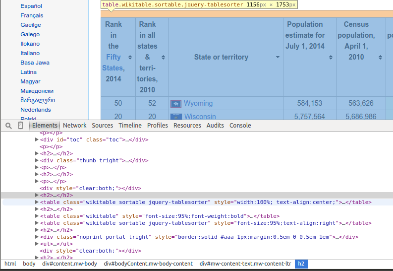
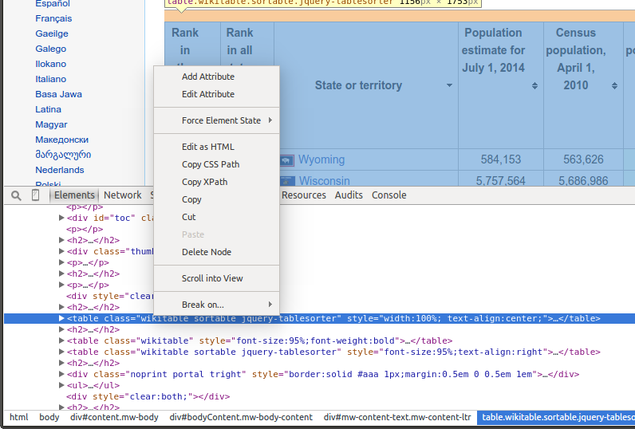

---
title: "Web Scraping in R using rvest"
author: "Hicham Zmarrou"
date: "`r Sys.Date()`"
output:
  html_notebook:
    highlight: pygments
    number_sections: no
    theme: cosmo
    toc: yes
    toc_float: yes
  html_document:
    df_print: paged
    toc: yes
  word_document:
    toc: yes
---
___________________________________________________________________________________________________________


# What is Web Scraping?
Web scraping is a technique for converting the data present in unstructured format (HTML tags) over the web to the structured format which can easily be accessed and used


# Why do we need Web Scraping?

To provide you with hands-on knowledge, we are going to scrap data from [IMDB](http://www.imdb.com). Some other possible applications that you can use web scrapping for are:

* Scraping periodic tables from a third party site needed for some analysis
* Scrapping movie rating data to create movie recommendation engines.
* Scrapping data from social media sites like Facebook and Twitter for performing tasks Sentiment analysis, opinion mining, etc.
* Scrapping user reviews and feedbacks from e-commerce sites like Amazon, Flipkart, etc.

# Pre-requisites

we'll be using the `rvest` package in `R` authored by Hadley Wickham. You can access the documentation for `rvest` package [here](https://cran.r-project.org/web/packages/rvest/rvest.pdf). Make sure you have this package installed. If you don't have this package by now, you can follow the following code to install it.

```{r eval=FALSE, include=FALSE}
install.packages("rvest")
```


# Scraping a web page using R

Now, let's get started with scraping the IMDb website for the 100 most popular feature films released in 2017. You can access them [here](http://www.imdb.com/search/title?count=100&release_date=2017,2017&title_type=feature).

```{r}
#instalp package 
#install.packages("rvest")
#Loading the rvest package
library('rvest')
#Specifying the url for desired website to be scrapped
url <- 'http://www.imdb.com/search/title?count=100&release_date=2017,2017&title_type=feature'

#Reading the HTML code from the website
webpage <- read_html(url)

#Scrape the website for the url of the movie poster
poster <- webpage %>%
  html_nodes(".loadlate") %>%
  html_attr("src")
poster[1]
```

```{r}

# Store web url
coco_movie <- read_html("http://www.imdb.com/title/tt2380307/?ref_=adv_li_i")
poster_coco <- coco_movie %>%
  html_nodes("#title-overview-widget img") %>%
  html_attr("src")
#poster_coco
#knitr::include_graphics(poster_coco[2])
#poster_coco[[1]]
```


Now, we'll be scraping the following data from this website.

* __Rank__: The rank of the film from 1 to 100 on the list of 100 most popular feature films released in 2017.

* __Title__: The title of the feature film.

* __Description__: The description of the feature film.

* __Runtime__: The duration of the feature film.

* __Genre__: The genre of the feature film,

* __Rating__: The IMDb rating of the feature film.

* __Metascore__: The metascore on IMDb website for the feature film.

* __Votes__: Votes cast in favor of the feature film.

* __Gross_Earning_in_Mil__: The gross earnings of the feature film in millions.

* __Director__: The main director of the feature film. Note, in case of multiple directors, I'll take only the first.

* __Actor__: The main actor of the feature film. Note, in case of multiple actors, I'll take only the first.

Here's a screenshot that contains how all these fields are arranged.

```{r movie1, echo = FALSE, out.width = "100%", fig.cap = "Most Popular Feature Films Released 2017-01-01 to 2017-12-31."}
knitr::include_graphics("img/popular_movies_1.png")
```

### Step 1: 

We will start with scraping the Rank field. For that, we'll use the selector gadget to get the specific CSS selectors that encloses the rankings. You can click on the extenstion in your browser and select the rankings field with cursor.

Make sure that all the rankings are selected. You can select some more ranking sections in case you are not able to get all of them and you can also de-select them by clicking on the selected section to make sure that you only have those sections highlighted that you want to scrap for that goal.


```{r movie2, echo = FALSE, out.width = "100%", fig.cap = "Most Popular Feature Films Released 2017-01-01 to 2017-12-31."}
knitr::include_graphics("img/popular_movies_2.png")
```


### Step 2:

Once you are sure that you have made the right selections, you need to copy the corresponding CSS selector that you can view in the bottom center.
```{r movie3, echo = FALSE, out.width = "100%", fig.cap = "Most Popular Feature Films Released 2017-01-01 to 2017-12-31."}
knitr::include_graphics("img/popular_movies_3.png")
```

### Step 3: 

Once you know the CSS selector that contains the rankings, you can use this simple R code to get all the rankings:

```{r}
#Using CSS selectors to scrap the rankings section
rank_data_html <- html_nodes(webpage,'.text-primary')

#Converting the ranking data to text
rank_data <- html_text(rank_data_html)
length(rank_data)
#Let's have a look at the rankings
head(rank_data)

```

The basic functions in `rvest` are powerful, and you should try to utilize the following functions when starting out a new project.

* `html_nodes()`: identifies HTML wrappers.

* `html_nodes(".class")`: calls node based on css class

* `html_nodes("#id")`: calls node based on <div> id

* `html_nodes(xpath="xpath")`: calls node based on xpath (we'll cover this later)

* `html_attrs()`: identifies attributes (useful for debugging)

* `html_table()`: turns HTML tables into data frames

* `html_text()`: strips the HTML tags and extracts only the text

Note on plurals: html_node() returns metadata for the node, html_nodes() iterates over the matching nodes.

### Step 4:## 

Once you have the data, make sure that it looks in the desired format. I am preprocessing my data to convert it to numerical format.

```{r}
#Data-Preprocessing: Converting rankings to numerical
rank_data<-as.numeric(rank_data)
#Let's have another look at the rankings
head(rank_data)

```
###  Step 5: 

Now you can clear the selector section and select all the titles. You can visually inspect that all the titles are selected. Make any required additions and deletions with the help of your curser. I have done the same here.


```{r}
#Using CSS selectors to scrap the title section
title_data_html <- html_nodes(webpage,'.lister-item-header a')

#Converting the title data to text
title_data <- html_text(title_data_html)
length(title_data)
#Let's have a look at the title
head(title_data)

```

### Step 7: 
The following code does the same thing for scrapping - Description, Runtime, Genre, Rating, Metascore, Votes, Gross_Earning_in_Mil , Director and Actor data.


#### Description
```{r}
#Using CSS selectors to scrap the description section
description_data_html <- html_nodes(webpage,'.text-muted+ .text-muted , .ratings-bar+ .text-muted')

#Converting the description data to text
description_data <- html_text(description_data_html)
#Let's have a look at the description data
length(description_data)
head(description_data)

#Data-Preprocessing: removing '\n'
description_data<-gsub("\n","",description_data)

#Let's have another look at the description data 
head(description_data)
```

#### Runtime

```{r}
#Using CSS selectors to scrap the Movie runtime section
runtime_data_html <- html_nodes(webpage,'.text-muted .runtime')

#Converting the runtime data to text
runtime_data <- html_text(runtime_data_html)
#Data-Preprocessing: removing mins and converting it to numerical
runtime_data<-gsub(" min","",runtime_data)
runtime_data<-as.numeric(runtime_data)
length(runtime_data)

#Let's have another look at the runtime data

for (i in c(21,27,55,78,82)){
      
    a<-runtime_data[1:(i-1)]
    b<-runtime_data[i:length(runtime_data)]
    runtime_data<-append(a,list("NA"))
    runtime_data<-append(runtime_data,b)
   
}
runtime_data<-as.numeric(unlist(runtime_data))
length(runtime_data)

#Let's have another look at the runtime data
head(runtime_data)
```

#### Genre

```{r}
#Using CSS selectors to scrap the Movie genre section
genre_data_html <- html_nodes(webpage,'.genre')

#Converting the genre data to text
genre_data <- html_text(genre_data_html)
#Let's have a look at the runtime
head(genre_data)

#Data-Preprocessing: removing \n
genre_data<-gsub("\n","",genre_data)
#Data-Preprocessing: removing excess spaces
genre_data<-gsub(" ","",genre_data)

#taking only the first genre of each movie
genre_data<-gsub(",.*","",genre_data)
#Convering each genre from text to factor
genre_data<-as.factor(genre_data)
length(genre_data)
#Let's have another look at the genre data
head(genre_data)
```

#### Rating
```{r}
#Using CSS selectors to scrap the IMDB rating section
rating_data_html <- html_nodes(webpage,'.ratings-imdb-rating strong')
#Converting the ratings data to text
rating_data <- html_text(rating_data_html)

#Let's have a look at the ratings
head(rating_data)

#Data-Preprocessing: converting ratings to numerical
rating_data<-as.numeric(rating_data)

#Let's have another look at the runtime data

for (i in c(4,21,27,55,60,62,78,83)){
      
    a<-rating_data[1:(i-1)]
    b<-rating_data[i:length(rating_data)]
    rating_data<-append(a,list("NA"))
    rating_data<-append(rating_data,b)
   
}
rating_data <-as.numeric(unlist(rating_data))

length(rating_data)

#Let's have another look at the ratings data
head(rating_data)
```

#### Votes
```{r}
#Using CSS selectors to scrap the votes section
votes_data_html <- html_nodes(webpage,'.sort-num_votes-visible span:nth-child(2)')


#Converting the votes data to text
votes_data <- html_text(votes_data_html)

#Let's have a look at the votes data
head(votes_data)

#Data-Preprocessing: removing commas
votes_data<-gsub(",","",votes_data)

#Data-Preprocessing: converting votes to numerical
votes_data<-as.numeric(votes_data)

for (i in c(4,21,27,55,60,62,78,83)){
      
    a<-votes_data[1:(i-1)]
    b<-votes_data[i:length(votes_data)]
    votes_data<-c(a,"NA")
    votes_data<-c(votes_data,b)
   
}

votes_data<-as.numeric(votes_data)

#Let's have another look at the votes data
head(votes_data)
```

#### Directors

```{r}
#Using CSS selectors to scrap the directors section
directors_data_html <- html_nodes(webpage,'.text-muted~ .text-muted+ p a:nth-child(1)')


#Converting the directors data to text
directors_data <- html_text(directors_data_html)

#Let's have a look at the directors data
head(directors_data)

#Data-Preprocessing: converting directors data into factors
directors_data<-as.factor(directors_data)
```

#### Actors

```{r}
#Using CSS selectors to scrap the actors section
actors_data_html <- html_nodes(webpage,'.lister-item-content .ghost+ a')
#Converting the gross actors data to text
actors_data <- html_text(actors_data_html)
#Let's have a look at the actors data
head(actors_data)
#Data-Preprocessing: converting actors data into factors
actors_data<-as.factor(actors_data)
```


```{r}
# But, I want you to closely follow what happens when I do the same thing for Metascore data.
#Using CSS selectors to scrap the metascore section
metascore_data_html <- html_nodes(webpage,'.metascore')
#Converting the runtime data to text
metascore_data <- html_text(metascore_data_html)
#Let's have a look at the metascore data 
head(metascore_data)
#Data-Preprocessing: removing extra space in metascore
metascore_data<-gsub(" ","",metascore_data)

#Lets check the length of metascore data
length(metascore_data)
```

##Step 8:

The length of meta score data is 81 while we are scrapping the data for 100 movies. The reason this happened is because there are 19 movies which don't have the corresponding Metascore fields.

```{r movie4, echo = FALSE, out.width = "100%", fig.cap = "Most Popular Feature Films Released 2017-01-01 to 2017-12-31."}
knitr::include_graphics("img/popular_movies_4.png")
```

## Step 9: 

It is a practical situation which can arise while scrapping any website. Unfortunately, if we simply add NA's to last 19 entries, it will map NA as Metascore for movies 81 to 100 while in reality, the data is missing for some other movies. 
A visual inspection showa that the Metascore is missing for movies 4,17,21,27,31,53,55,60,62,70,72,74,78,82,83,86,88,92,94 
We use the following function to get around this problem.

```{r}
for (i in c(4,17,21,27,31,53,55,60,62,70,72,74,78,82,83,86,88,92,94)){
      
    a<-metascore_data[1:(i-1)]
    b<-metascore_data[i:length(metascore_data)]
    metascore_data<-append(a,list("NA"))
    metascore_data<-append(metascore_data,b)

}

#Data-Preprocessing: converting metascore to numerical
metascore_data<-as.numeric(metascore_data)

#Let's have another look at length of the metascore data

length(metascore_data)

#Let's look at summary statistics
summary(metascore_data)

```


##Step 10: 

The same thing happens with the Gross variable which represents gross earnings of that movie in millions. We use the same solution to work my way around:

```{r}
#Using CSS selectors to scrap the gross revenue section
gross_data_html <- html_nodes(webpage,'.ghost~ .text-muted+ span')

#Converting the gross revenue data to text
gross_data <- html_text(gross_data_html)

#Let's have a look at the votes data
head(gross_data)


#Data-Preprocessing: removing '$' and 'M' signs
gross_data<-gsub("M","",gross_data)

gross_data<-substring(gross_data,2,6)

#Let's check the length of gross data
length(gross_data)

#Filling missing entries with NA
for (i in c(7,17,21,27,31,35,36,40,49,53,55,56,60,61,62,63,65,70,72,74,78,80,82,83,85,88,91,94)){
      a<-gross_data[1:(i-1)]
      b<-gross_data[i:length(gross_data)]
      gross_data<-append(a,list("NA"))
      gross_data<-append(gross_data,b)
  }

#Data-Preprocessing: converting gross to numerical
gross_data<-as.numeric(gross_data)

#Let's have another look at the length of gross data
length(gross_data)

```


## Step 11: 

Now we have successfully scrapped all the 11 features for the 100 most popular feature films released in 2017. 
Let's combine them to create a dataframe and inspect its structure

```{r}
#Combining all the lists to form a data frame
movies_df<-data.frame(Rank = rank_data, Title = title_data, Description = description_data, Runtime = runtime_data,
                      Genre = genre_data, Rating = rating_data, Metascore = metascore_data, Votes = votes_data,
                      Gross_Earning_in_Mil = gross_data, Director = directors_data, Actor = actors_data)

#Structure of the data frame
str(movies_df)
```


We have now successfully scrapped the IMDb website for the 100 most popular feature films released in 2017.


## Analyzing scraped data from the web

Once we have the data, you can perform several tasks like analyzing the data, drawing inferences from it, training machine learning models over this data, etc. We create some interesting visualization out of the data we have just scrapped. Follow the visualizations and answer the questions given below. Post your answers in the comment section below.

```{r}
library('ggplot2')
ggplot(data = movies_df, aes(Runtime, fill = Genre)) +
  geom_histogram(binwidth = 5)
```

Question 1: Based on the above data, which movie from which Genre had the longest runtime?

 
```{r}
ggplot(movies_df,aes(x=Runtime,y=Rating))+
geom_point(aes(size=Votes,col=Genre))
```


Question 2: Based on the above data, in the Runtime of 130-160 mins, which genre has the highest votes?

 

```{r}
ggplot(movies_df,aes(x=Runtime,y=Gross_Earning_in_Mil))+
            geom_point(aes(size=Rating,col=Genre))
```


Question 3: Based on the above data, across all genres which genre has the highest average gross earnings in runtime 100 to 120.


### html_table() example

Go to this [link](https://www.nis.gov.kh/cpi/Jan14.html) and inspect the html.

```{r}
# To scrape a table from a website, the html_table() function can be a game-changer.
# But it doesn't give us the right output right away. 
URL2 <- "https://www.nis.gov.kh/cpi/Apr14.html"

# TIP: When debugging or building your scraper, assign a variable to the raw HTML.
# That way you only have to read it once
accounts <- read_html(URL2) 

table <- accounts %>%
  html_nodes("table") %>%
  html_table(header=T)

# You can clean up the table with the following code, or something like it. 
# table[[1]]
dict <- table[[1]][,1:2]
accounts_df <- table[[1]][6:18,-1]

names <- c('id', 'weight.pct', 'jan.2013', 'dec.2013', 'jan.2014', 'mo.pctch', 'yr.pctch', 'mo.cont', 'yr.cont')
colnames(accounts_df) <- names

accounts_df #%>% str()
```


### Using xpath

The final method for extracting data from a webpage is to call the data using it's xpath. Sometimes, we want very specific data from a website. Maybe we don't want only specific information from a table.

The xpath option can be very useful for doing this, but it is not super intuitive. Think of this as directions you are giving rvest to the specific pice of data you're interested in scraping.

The first thing I needed to do was browse to the desired [page](https://en.wikipedia.org/wiki/List_of_U.S._states_and_territories_by_population) and locate the table. In this case, it's a table of US state populations from wikipedia. `rvest` needs to know what table we want, so (using the Chrome web browser), I right clicked and chose "inspect element". This splits the page horizonally. As you hover over page elements in the html on the bottom, sections of the web page are highlighted on the top.


```{r wikitb1, echo = FALSE, out.width = "100%"}

```


```{r wikitb2, echo = FALSE, out.width = "100%"}

```


```{r}
url <- "http://en.wikipedia.org/wiki/List_of_U.S._states_and_territories_by_population"
population <- url %>%
  read_html() %>%
  html_nodes(xpath='//*[@id="mw-content-text"]/div/table[1]') %>%
  html_table()
population <- population[[1]]

head(population)

```


