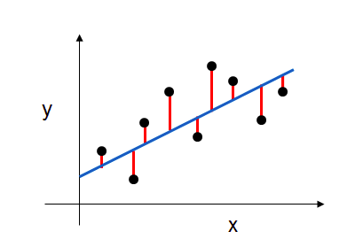
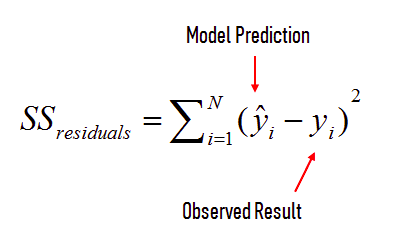
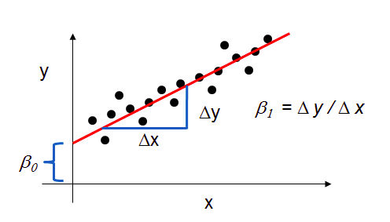
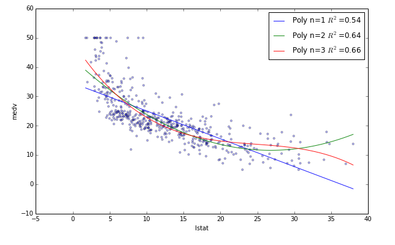

```{r global_options, include=FALSE}
knitr::opts_chunk$set(fig.width=12, fig.height=8, fig.path='img/',
                      echo=TRUE, warning=FALSE, message=FALSE,digits = 3)
```

### Motivation
#### Why are we learning linear regression?
* widely used
* runs fast
* easy to use (not a lot of tuning required)
* highly interpretable
* basis for many other methods


### Example: Advertising Data
Let's take a look at some data, ask some questions about that data, and then use linear regression to answer those questions!

```{r}
# read data into a DataFrame
suppressWarnings(suppressPackageStartupMessages(library(tidyverse)))
suppressWarnings(suppressPackageStartupMessages(library(ISLR)))
suppressWarnings(suppressPackageStartupMessages(library(MASS)))
Advertising<-  read_csv('http://www-bcf.usc.edu/~gareth/ISL/Advertising.csv')
Advertising[,1] <- NULL 
Advertising
Advertisingg <- gather(Advertising, medium, spending,TV:newspaper)
##Advertisingg
```

#### What are the features?
`TV`: advertising dollars spent on `TV` for a single product in a given market (in thousands of dollars)

`radio`: advertising dollars spent on radio

`newspaper`: advertising dollars spent on newspaper

#### What is the response?
`sales`: sales of a single product in a given market (in thousands of widgets)

```{r}
# print the shape of the DataFrame
dim(Advertising)
```
There are 200 observations, and thus 200 markets in the dataset.
```{r}
# visualize the relationship between the features and the response using scatterplots
source("multiplot.R")
p1<- ggplot(data = Advertising) + geom_point(mapping = aes(x = TV, y = sales),color = "blue")
p2<- ggplot(data = Advertising) + geom_point(mapping = aes(x = radio, y = sales),color = "green")
p3<- ggplot(data = Advertising) + geom_point(mapping = aes(x = newspaper, y = sales),color = "red")
p4<- ggplot(data = Advertisingg)+ geom_point(mapping = aes(x = spending, y = sales, color = medium))+theme(legend.position = "bottom")

multiplot(p1, p2, p3, p4, cols=2)
```

```{r}
pairs(Advertising)
```


#### Questions About the Advertising Data

Let's pretend you work for the company that manufactures and markets this widget. The company might ask you the following: On the basis of this data, how should we spend our advertising money in the future?
This general question might lead you to more specific questions:
Is there a relationship between ads and sales?
How strong is that relationship?
Which ad types contribute to sales?
What is the effect of each ad type of sales?
Given ad spending in a particular market, can sales be predicted?
We will explore these questions below!

#### Simple Linear Regression

Simple linear regression is an approach for predicting a quantitative response using a single feature (or "predictor" or "input variable"). It takes the following form:

<center>$y = \beta_0 + \beta_1x$</center>

With oth words it says what is the expected valye of $y$ given a realisation of $x$ mathematically 
<center>$\hat{E}[Y \mid X = x] = \beta_0 + \beta_1.X$</center>

What does each term represent?

* $y$ is the response
* $x$ is the feature/predictor
* $\beta_0$ is the intercept
* $\beta_1$ is the coefficient for $x$

Together, $\beta_0$ and $\beta_1$ are called the model coefficients. To create your model, you must "learn" the values of these coefficients. And once we've learned these coefficients, we can use the model to predict sales!

### Estimating ("Learning") Model Coefficients
Generally speaking, coefficients are estimated using the least squares criterion, which means we are find the line (mathematically) which minimizes the sum of squared residuals (or "sum of squared errors"):

  


#### What elements are present in the diagram?
* The black dots are the observed values of x and y.
* The blue line is our least squares line.
* The red lines are the residuals, which are the distances between the observed values and the least squares line.

#### How do the model coefficients relate to the least squares line?

* $\beta_0$ is the intercept (the value of $y$ when $x$=0)
* $\beta_1$ is the slope (the change in $y$ divided by change in $x$)

Here is a graphical depiction of those calculations:

<center></center>


Let's use `lm` function ind the base `R` to estimate the model coefficients for the advertising data:

```{r kable, results = 'asis'}
# create a fitted model in one line
library(broom)
lrmod <-  lm(sales ~ TV, data= Advertising)
tidy(lrmod)

```

#### Interpreting Model Coefficients
How do we interpret the `TV` coefficient ($\beta_1$)?

A "unit" increase in `TV` ad spending is associated with a $0.047537$ "unit" increase in sales.
Or more clearly: An additional $1,000 spent on `TV` ads is associated with an increase in `sales` of 47.537 widgets.

Note that if an increase in `TV` ad spending was associated with a decrease in `sales`, $\beta_1$ would be negative.

#### Using the Model for Prediction
Let's say that there was a new market where the `TV` advertising spend was $50,000. What would we predict for the sales in that market?

```{r}
# manually calculate the prediction
7.032594 + 0.047537*50
```

Thus, we would predict sales of 9,409 widgets in that market.
Of course, we can also the `predict` function  to make the prediction:
```{r}
predict(lrmod, data.frame(TV = c(50,75,125)))
```

#### Plotting the Least Squares Line
Let's make predictions for the smallest and largest observed values of $x$, and then use the predicted values to plot the least squares line

```{r}
options( warn = 1)
ggplot() + geom_point(data = Advertising,aes(TV,sales), color = "blue") 

```

#### Plotting the Least Squares Line
Let's make predictions for the smallest and largest observed values of $x$, and then use the predicted values to plot the least squares line


#### Confidence in our Model
Question: Is linear regression a high bias/low variance model, or a low bias/high variance model?

Answer: High bias/low variance. Under repeated sampling, the line will stay roughly in the same place (low variance), but the average of those models won't do a great job capturing the true relationship (high bias). Note that low variance is a useful characteristic when you don't have a lot of training data!

A closely related concept is confidence intervals. `lm` calculates 95% confidence intervals for our model coefficients, which are interpreted as follows: If the population from which this sample was drawn was sampled 100 times, approximately 95 of those confidence intervals would contain the "true" coefficient.
```{r}
confint(lrmod)
```

Keep in mind that we only have a single sample of data, and not the entire population of data. The "true" coefficient is either within this interval or it isn't, but there's no way to actually know. We estimate the coefficient with the data we do have, and we show uncertainty about that estimate by giving a range that the coefficient is probably within.
Note that using 95% confidence intervals is just a convention. You can create 90% confidence intervals (which will be more narrow), 99% confidence intervals (which will be wider), or whatever intervals you like.

#### Hypothesis Testing and p-values
Closely related to confidence intervals is hypothesis testing. Generally speaking, you start with a null hypothesis and an alternative hypothesis (that is opposite the null). Then, you check whether the data supports rejecting the null hypothesis or failing to reject the null hypothesis.

(Note that "failing to reject" the null is not the same as "accepting" the null hypothesis. The alternative hypothesis may indeed be true, except that you just don't have enough data to show that.)
As it relates to model coefficients, here is the conventional hypothesis test:
null hypothesis: There is no relationship between `TV` ads and sales (and thus $\beta_1$ equals zero)
alternative hypothesis: There is a relationship between `TV` ads and sales (and thus $\beta_1$ is not equal to zero)

Null hypothesis $H_0$ : There is no relationship between `TV` and `sales`.

Alternative hypothesis $H_a$ : There is some relationship between `TV`
and `sales`. 

This is mathematically equivalent to

<center>$H_0 :  \beta_1 = 0; \quad H_a :  \beta_1 \neq 0$</center>
 
How do we test this hypothesis? Intuitively, we reject the null (and thus believe the alternative) if the 95% confidence interval does not include zero. Conversely, the p-value represents the probability that the coefficient is actually zero:

We use the `broom` package to convert the messy output of built-in functions in R, such as lm, nls, or t.test, and turns them into tidy data frames.

```{r}
library(broom)
# tidyres <-tidy(lrmod)
tidy(lrmod) %>% .$p.value
```
If the 95% confidence interval includes zero, the p-value for that coefficient will be greater than 0.05. If the 95% confidence interval does not include zero, the p-value will be less than 0.05. Thus, a p-value less than 0.05 is one way to decide whether there is likely a relationship between the feature and the response. (Again, using 0.05 as the cutoff is just a convention.)

In our example, the p-value for `TV` is far less than 0.05, and so we believe that there is a relationship between `TV` ads and `sales`.

Note that we generally ignore the p-value for the intercept.

#### How Well Does the Model Fit the data?

The most common way to evaluate the overall fit of a linear model is by the **R-squared** value. R-squared is the proportion of variance explained, meaning the proportion of variance in the observed data that is explained by the model, or the reduction in error over the null model. (The null model just predicts the mean of the observed response, and thus it has an intercept and no slope.)

<center></center>

R-squared is between 0 and 1, and higher is better because it means that more variance is explained by the model. Here's an example of what R-squared "looks like"
You can see that the __blue line__ explains some of the variance in the data (R-squared=0.54), the __green line__ explains more of the variance (R-squared=0.64), and the __red line__ fits the training data even further (R-squared=0.66). (Does the red line look like it's overfitting?)
Let's calculate the R-squared value for our simple linear model:

Let's calculate the R-squared value for our simple linear model:

```{r}
options(warn = 0)
rSquared <- glance(lrmod)[1,1]
rSquared
```
Is that a "good" R-squared value? It's hard to say. The threshold for a good R-squared value depends widely on the domain. Therefore, it's most useful as a tool for comparing different models.

#### Multiple Linear Regression
Simple linear regression can easily be extended to include multiple features. This is called multiple linear regression:
$y = \beta_0 + \beta_1x_1 + ... + \beta_nx_n$
Each $x$ represents a different feature, and each feature has its own coefficient. In this case:
$y = \beta_0 + \beta_1 \times TV + \beta_2 \times radio + \beta_3 \times newspaper$
Let's use Statsmodels to estimate these coefficients:


```{r}
mlrmod <-  lm(sales ~ TV + radio + newspaper, data= Advertising)
summary(mlrmod)
tidy(mlrmod)
```


## What are a few key things we learn from this output?

* `TV` and `radio` have significant `p-values`, whereas newspaper does not. Thus we reject the null hypothesis for `TV` and `radio` (that there is no association between those features and sales), and fail to reject the null hypothesis for newspaper.

* `TV` and `radio` ads spending are both positively associated with `sales`, whereas `newspaper` ad spending is slightly negatively associated with `sales`. (However, this is irrelevant since we have failed to reject the null hypothesis for newspaper.)

* This model has a higher **R-squared** (0.897) than the previous model, which means that this model provides a better fit to the data than a model that only includes TV.

### Feature Selection

How do I decide __which features to include__ in a linear model? Here's one idea:

* Try different models, and only keep predictors in the model if they have small `p-values`.
* Check whether the R-squared value goes up when you add new predictors.

#### What are the drawbacks to this approach?

* Linear models rely upon a lot of assumptions (such as the features being independent), and if those assumptions are violated (which they usually are), R-squared and p-values are less reliable.
* Using a p-value cutoff of 0.05 means that if you add 100 predictors to a model that are pure noise, 5 of them (on average) will still be counted as significant.
* R-squared is susceptible to overfitting, and thus there is no guarantee that a model with a high R-squared value will generalize. Below is an example:

```{r}
# only include TV and radio in the model

mlrmod   <- lm(sales ~ TV + radio, data = Advertising)
rSquared <- glance(lrmod)[1,1]
rSquared
#summary(mlrmod)
```


```{r}
# add newspaper to the model (which we believe has no association with sales)

mlrmod   <- lm(sales ~ TV + radio + newspaper, data = Advertising)
# mlrmod   <- lm(sales ~ ., data = Advertising)
rSquared <- glance(lrmod)[1,1]
rSquared
#summary(mlrmod)
```

R-squared will always increase as you add more features to the model, even if they are unrelated to the response. Thus, selecting the model with the highest R-squared is not a reliable approach for choosing the best linear model.

There is alternative to R-squared called adjusted R-squared that penalizes model complexity (to control for overfitting), but it generally under-penalizes complexity.

So is there a better approach to feature selection? Cross-validation. It provides a more reliable estimate of out-of-sample error, and thus is a better way to choose which of your models will best generalize to out-of-sample data. There is extensive functionality for cross-validation in scikit-learn, including automated methods for searching different sets of parameters and different models. Importantly, cross-validation can be applied to any model, whereas the methods described above only apply to linear models.


### Handling categorical predictors with two categories
Up to now, all of our predictors have been numeric. What if one of our predictors was categorical?
Let's create a new feature called `Size`, and randomly assign observations to be small or large:

```{r}
# set a seed for reproducibility
set.seed(12345)
# create a Series of booleans in which roughly half are True
nums       = runif(nrow(Advertising), 0, 1) 
mask_large = nums > 0.5  
# initially set Size to small, then change roughly half to be large
Advertising[['Size']] = rep('small',nrow(Advertising))
Advertising$Size[mask_large] = 'large'
Advertising$Size = as.factor(Advertising$Size)
#Advertising      =  Advertising %>% mutate(isLarge = factor(if_else(Size == "large",1,0))) %>% dplyr::select(-Size) 
Advertising
#levels(Advertising$Size)
mlrmodc2   <- lm(sales ~ ., data = Advertising)
#summary(mlrmod)
tidy(mlrmodc2)
```

How do we interpret the Sizesmall coefficient? For a given amount of TV/radio/newspaper ads spending, being a small market is associated with an average increase in sales of 256 widgets (as compared to a large market, which is called the baseline level).


### Handling categorical predictors with more than two categories
Let's create a new feature called Area, and randomly assign observations to be rural, suburban, or urban:


```{r}
#Advertising<-  read_csv('http://www-bcf.usc.edu/~gareth/ISL/Advertising.csv')
# Advertising[,1] <- NULL 
# set a seed for reproducibility
set.seed(12345)
nums          = runif(nrow(Advertising), 0, 1) 
# initially set Size to small, then change
mask_suburban = (nums > 0.33) & (nums < 0.66)
mask_urban    = nums > 0.66
Advertising[['Area']]= rep('rural',nrow(Advertising))

Advertising$Area[mask_suburban] = 'suburban'
Advertising$Area[mask_urban] = 'urban'
Advertising
mlrmodc   <- lm(sales ~ ., data = Advertising)
#summary(mlrmodc)
tidy(mlrmodc)
```

#### How do we interpret the coefficients?

Holding all other variables fixed, being a suburban area is associated with an average decrease in sales of 417 widgets (as compared to the baseline level, which is rural). Being an urban area is associated with an average decrease in sales of 911 widgets (as compared to rural).

A final note about dummy encoding: If you have categories that can be ranked (i.e., strongly disagree, disagree, neutral, agree, strongly agree), you can potentially use a single dummy variable and represent the categories numerically (such as 1, 2, 3, 4, 5).

### Interactions
Interactions can be introduced to the `lm()` procedure in a number of ways.

We can use the `:` operator to introduce a single interaction of interest.

```{r}
Advertising<-  read.csv('http://www-bcf.usc.edu/~gareth/ISL/Advertising.csv')
Advertising[,1] <- NULL 
lrimod = lm(sales ~ . + TV:newspaper, data = Advertising)
coef(lrimod)

```
The response `~ . ^ k` syntax can be used to model all `k-way` interactions. (As well as the appropriate lower order terms.) Here we fit a model with all two-way interactions, and the lower order main effects.

```{r}
#Advertising<-  read_csv('http://www-bcf.usc.edu/~gareth/ISL/Advertising.csv')
#Advertising[,1] <- NULL
lrimod2 = lm(sales ~ . ^ 2, data = Advertising)
coef(lrimod2)
```

The `*` operator can be used to specify all interactions of a certain order, as well as all lower order terms according to the usual hierarchy. Here we see a three-way interaction and all lower order terms.

```{r}
mod_4 = lm(sales ~ TV * radio * newspaper, data = Advertising)
coef(mod_4)
```
### Interpretation 
#### Interaction between two continuous variables


```{r}
summary(lm(sales ~ TV * radio, data = Advertising))
```

### What does the coefficients means:

* `(Intercept)`: With 0 `TV` ads and with 0 `radio` ads the `sales` will be $6.750$
* `TV`: increasing `TV` ads by 1000 at zero `radio` ads increase sales by $19.1$ widgets
* `radio`: increasing radio ads by 1000 at zero `TV` ads increase sales by $28.9$ widgets
* `TV:radio`: the effect of `TV` ads on sales increases by 1.09 for every $1000$ unit increase in `radio` ads. 

For example at `radio` ads of 0 the slope between `TV` ads and `sales` is almost equal $0.02$, at radio ads of 10 the slope between `TV` ads and `sales` will be almost equal $0.0309 = 0.02+(10*1.09/1000)$   

```{r}
# plot
ggplot(Advertising, aes(x = TV, y = sales, color = radio))+ geom_point(size = 2) + scale_color_gradient(low = "red", 
    high = "green") + geom_abline(intercept = 6.75, slope =  0.02, color = "red", size = 1) +
    geom_abline(intercept = 6.75, slope = (55 * 0.00109)+0.02, color = "green", 
    size = 1) + geom_abline(intercept = 6.75, slope = (25 * 0.00109) +0.02, color = "brown", 
    size = 1) +
    geom_text(label = "sales = 6.75 + (0.02+ 0*0.00109)*TV", x = 100, y = 7, color = "red", size = 4, angle=10) + 
    geom_text(label = "sales = 6.75 + (0.02+ 25*0.00109)*TV", x = 180, y = 17, color = "brown", size = 4, angle=15) +   
    geom_text(label = "sales = 6.75 + (0.02+ 55*0.00109)*TV", x = 150, y = 22, color = "green", size = 4, angle=25) 
```

### Interaction between one continuous and one categorical variables

Now let's turn to another case, there we are weighting standardize soil samples, we added a temperature treatment with two levels (Low, High) and we measured the soil nitrogen concentration, we would like to see the effects of the nitrogen concentration and its interaction with temperature on soil weight.


```{r}
set.seed(12345)
# create a Series of booleans in which roughly half are True
nums       = runif(nrow(Advertising), 0, 1) 
mask_large = nums > 0.5  
# initially set Size to small, then change roughly half to be large
Advertising[['Size']] = rep('small',nrow(Advertising))
Advertising$Size[mask_large] = 'large'
Advertising$Size = as.factor(Advertising$Size)
#Advertising      =  Advertising %>% mutate(isLarge = factor(if_else(Size == "large",1,0))) %>% dplyr::select(-Size) 
Advertising
levels(Advertising$Size)
mlrmodcc   <- lm(sales ~ TV*Size, data = Advertising)
summary(mlrmodcc)
```


Again let's go through the coefficients:

* (Intercept): Under large market size conditions and with a TV ads of  $0$, sales are equla to  7.434414.

* TV:  increase of $1000 in TV ad spending is associated with an increase in sales of 44.620 widgets.

* SizeSmall: Under small market conditions and TV ad spending equals $0$ sales are 1.064 lower compared to large market size condition.

* TV:Sizesmall : the effect of TV ads on sales is higher by 0.007 under small market conditions compared to large market conditions. In other words the slope between TV ads and sales is 0.044+0.007 = 0.051 in small size markets.


### What Didn't we cover?
* Detecting collinearity
* Diagnosing model fit
* Transforming predictors to fit non-linear relationships
* Assumptions of linear regression
* Automatic model selection 
* And so much more!


You could certainly go very deep into linear regression, and learn how to apply it really, really well. It's an excellent way to start your modeling process when working a regression problem. However, it is limited by the fact that it can only make good predictions if there is a linear relationship between the features and the response, which is why more complex methods (with higher variance and lower bias) will often outperform linear regression.
Therefore, we want you to understand linear regression conceptually, understand its strengths and weaknesses, be familiar with the terminology, and know how to apply it. However, we also want to spend time on many other machine learning models, which is why we aren't going deeper here.

### Resources
To go much more in-depth on linear regression, read Chapter 3 of An Introduction to Statistical Learning (resources), from which this lesson was adapted. Alternatively, watch the related videos.


